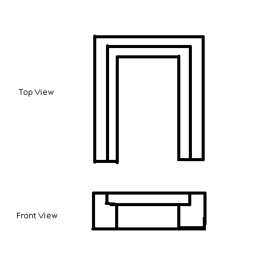
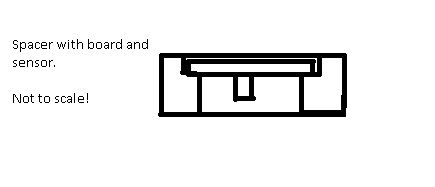

# reflective-module

A module containing a refective sensor for detection of grayscale and
 dark lines on a reflective surface. OpenSCAD will be used to visualize 
 the module and to draw component parts. One or more parts will be 3D 
 printed.

## Component parts

### The reflective sensor is a QRD1114

This image was created with openSCAD.

### The prototype board

detail to come

### The 3D printed spacer

I’m thinking of it would look something like this:

It has a grove that the prototype board could fit in. the board would be mounted horizontally.
The sensor would be mounted under the board pointing downward.
The front part of the spacer is open so a person could see the position of the sensor relative to the 
reflective surface.

So if I add the board and sensor to the front view it would look something like this

I was also considering a variant of this that would be more wedge shaped to the sensor would end up 
tilted relative to the surface (as it is on the robot). That would be better for use over electricians 
table which has a specular reflection and is problematic if the sensor is not at an angle to the surface.

As a note I should point out the spacing of the pins on the board are not exactly on a 0.1” grid but 
they are close enough to a 0.1” grid that it does fit flush on my board.

...under development...
