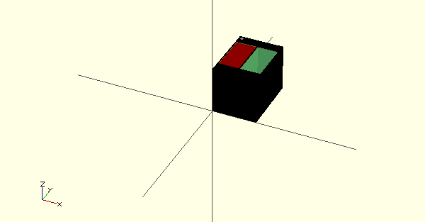

# reflective-module

A module containing a refective sensor for detection of grayscale and
 dark lines on a refective surface.

## The reflctive sensor is a QRD1114

This image was created with openSCAD.

